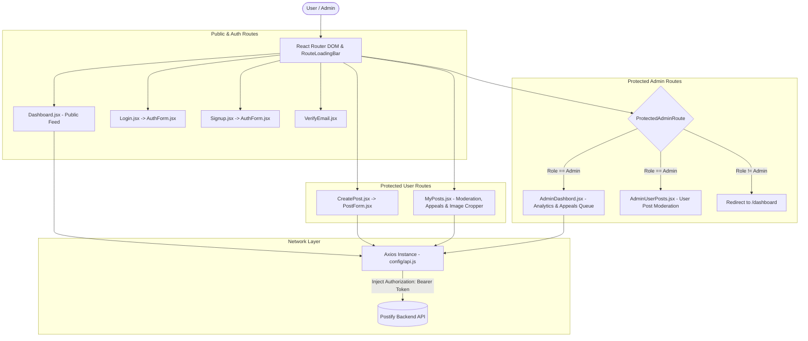

# 🚀 Postify Frontend — Single Page Application


> The modern web interface for **Postify** — an intuitive, highly responsive social media platform built with React 19, Vite, Tailwind CSS, and `react-hook-form`. Features dynamic feeds, interactive post cards, image cropping & previews, press-and-hold hero banners, centered custom modals, role-based navigation, and an admin moderation workflow.

---

## 🎨 UI Architecture & Data Flow



---

## 📁 Repository Directory Layout

```
postifyFrontend/
├── 📁 public/                    # Static public web assets
├── 📁 src/
│   ├── 📁 assets/                # Images, icons, and SVG graphic assets
│   ├── 📁 components/            # Modular & Reusable UI components
│   │   ├── 📁 common/            # Atomic Core Reusable Components
│   │   │   ├── EmptyState.jsx    # Unified empty state view for feeds & lists
│   │   │   ├── FormInput.jsx     # Reusable input control linked to react-hook-form
│   │   │   ├── FormTextArea.jsx  # Reusable textarea control linked to react-hook-form
│   │   │   ├── LoadingScreen.jsx # Full-screen loading spinner page
│   │   │   ├── RoleBadge.jsx     # Stylized role pill (Admin vs User)
│   │   │   ├── RouteLoadingBar.jsx # Top route transition loading bar
│   │   │   └── UserAvatar.jsx    # Centralized avatar letter rendering
│   │   ├── 📁 forms/             # Reusable MVC Form Views & Controllers
│   │   │   ├── AuthForm.jsx      # Reusable form component handling Login & Signup
│   │   │   └── PostForm.jsx      # Reusable post creation form component
│   │   ├── 📁 modals/            # Reusable Dialog & Overlay Components
│   │   │   └── ConfirmModal.jsx  # Aesthetic centered screen confirmation modal card
│   │   ├── MyPostList.jsx        # Managed post list with inline edit/delete/appeal controls
│   │   ├── Navbar.jsx            # Navigation bar with route progress bar & theme toggle
│   │   ├── PostifyHeaderBanner.jsx # SVG hero graphics asset
│   │   ├── PostifyHeroSection.jsx # 15s Press-and-hold interactive hero banner
│   │   └── PostifyLogo.jsx       # SVG brand logo component
│   ├── 📁 config/
│   │   ├── api.js                # Axios client setup with JWT request interceptor
│   │   └── post.api.js           # API service functions for feed, posts & admin endpoints
│   ├── 📁 pages/
│   │   ├── AdminDashbord.jsx     # Admin panel metrics dashboard & appeals queue
│   │   ├── AdminUserPosts.jsx    # Admin user history inspection & moderation actions
│   │   ├── CreatePost.jsx        # Post creation view consuming PostForm
│   │   ├── Dashboard.jsx         # Community feed with likes/comments/shares & error recovery
│   │   ├── Login.jsx             # Clean login page consuming AuthForm
│   │   ├── MyPosts.jsx           # User post management with Image Preview & Cropper
│   │   ├── Signup.jsx            # Clean signup page consuming AuthForm
│   │   └── VerifyEmail.jsx       # Email token verification state screen
│   ├── 📁 routes/
│   │   ├── AppRoutes.jsx         # Root router builder (`createBrowserRouter`)
│   │   ├── AuthRoutes.jsx        # Public and authentication route definitions
│   │   ├── PostRoutes.jsx        # Authenticated user post creation & management routes
│   │   ├── ProtectedAdminRoute.jsx # Guard HOC verifying JWT admin role claims
│   │   └── ProtectedRoutes.jsx   # Admin route definitions guarded by ProtectedAdminRoute
│   ├── 📁 utils/
│   │   └── cropImage.js          # Canvas-based image cropping utility
│   ├── App.jsx                   # Application root element with RouterProvider
│   ├── index.css                 # Tailwind CSS imports & global theme styles
│   └── main.jsx                  # React DOM root entry point
├── .env.example                  # Environment variables template
├── eslint.config.js              # ESLint linting rules
├── index.html                    # Single Page Application HTML document template
├── package.json                  # Dependencies, scripts, and dev tools
└── vite.config.js                # Vite build bundler configuration
```

---

## 🗺️ Client Route Architecture

| Path | View Component | Access Level | Description |
| :--- | :--- | :--- | :--- |
| `/` or `/dashboard` | `Dashboard.jsx` | Public | Main social feed displaying active public posts |
| `/login` | `Login.jsx` | Public | User authentication login page (via `AuthForm`) |
| `/signup` | `Signup.jsx` | Public | User registration page (via `AuthForm`) |
| `/verify-email` | `VerifyEmail.jsx` | Public | Token verification feedback screen |
| `/create` | `CreatePost.jsx` | Authenticated | Post creation page (via `PostForm`) |
| `/my-posts` | `MyPosts.jsx` | Authenticated | Manage posts, crop images, submit appeals |
| `/admin/dashboard` | `AdminDashbord.jsx` | Admin Only | System metrics dashboard & appeals queue |
| `/admin/user/:userId` | `AdminUserPosts.jsx` | Admin Only | Moderate post history for a specific user |

---

## 🛠️ Key Architectural & UI Enhancements

- 📋 **Official `react-hook-form` Integration**: Clean form validation and state management using `react-hook-form` v7.
- 🧱 **Reusable Atomic Component System**: Centralized `<UserAvatar />`, `<RoleBadge />`, `<EmptyState />`, `<FormInput />`, and `<FormTextArea />` for 100% DRY code.
- ✂️ **Image Preview & Interactive Cropper**: Full image editing capability powered by `react-easy-crop` and custom canvas helper (`cropImage.js`) with Free, 1:1, 4:3, 16:9, 3:4 aspect ratios and zoom slider controls.
- 👆 **Press-and-Hold Story-style Hero Banner**: `PostifyHeroSection` auto-dismisses after 15 seconds, allowing users to press & hold (`onMouseDown` / `onTouchStart`) to pause the countdown and release to resume.
- 🎯 **Centered Custom Confirmation Modal**: Replaced standard browser `window.confirm` popups with `<ConfirmModal />`, a backdrop-blurred centered dialog card with loading states.
- 🌀 **Robust Loading & Error Recovery**: Animated spinning circle loaders during feed fetching and dedicated Error Cards with a **"Retry Loading"** action button for server/network failures.
- 🚦 **Route Transition Loading Bar**: `<RouteLoadingBar />` displays a top progress bar during page switches.
- 🔑 **Automatic Token Interceptors**: Axios instance automatically injects JWT tokens and handles unauthorized redirects.

---

## 🚦 Getting Started & Local Development

> ⚡ **Package Manager**: This project uses **`pnpm`** for fast, efficient dependency management.

```bash
# 1. Clone & navigate to frontend directory
cd postifyFrontend

# 2. Install dependencies using pnpm
pnpm install

# 3. Create .env file from template
cp .env.example .env

# 4. Start Vite development server
pnpm run dev

# 5. Build production bundle
pnpm run build

# 6. Preview production build locally
pnpm run preview
```

---

## 📄 License & Author

- **Author**: Aditya Singh
