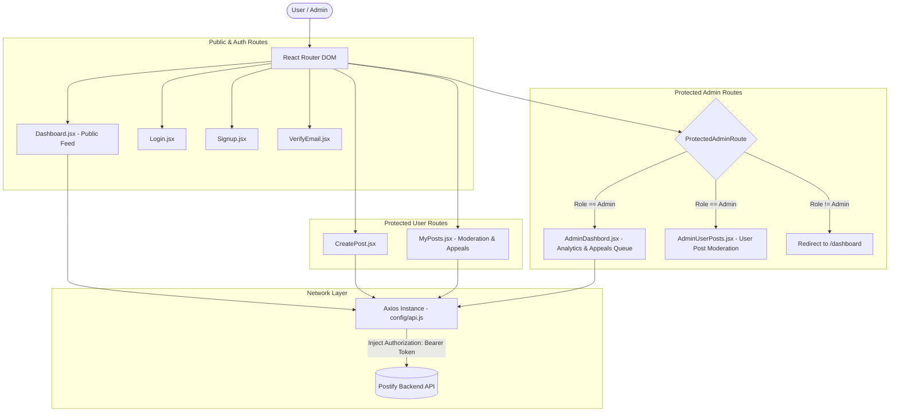

# 🚀 Postify Frontend — Single Page Application


> The modern web interface for **Postify** — an intuitive, responsive social media platform built with React 19, Vite, and Tailwind CSS. Features dynamic feeds, interactive post cards, image previews, role-based navigation, and an admin moderation workflow.

---

## 🎨 UI Architecture & Data Flow



---

## 📁 Repository Directory Layout

```
authFrontend/
├── 📁 public/                    # Static public web assets
├── 📁 src/
│   ├── 📁 assets/                # Images, icons, and SVG graphic assets
│   ├── 📁 components/            # Reusable UI components
│   │   ├── Navbar.jsx            # Dynamic navigation bar with user context & auth controls
│   │   └── MyPostList.jsx        # Managed post list with inline edit/delete controls
│   ├── 📁 config/
│   │   ├── api.js                # Axios client setup with JWT request interceptor
│   │   └── post.api.js           # API service functions for feed, posts & admin endpoints
│   ├── 📁 pages/
│   │   ├── AdminDashbord.jsx     # Admin panel stats metrics & pending appeals queue
│   │   ├── AdminUserPosts.jsx    # Admin user history inspection & moderation actions
│   │   ├── CreatePost.jsx        # Dedicated post creation view with image preview
│   │   ├── Dashboard.jsx         # Main public social feed with likes/comments/shares
│   │   ├── Login.jsx             # Secure login screen
│   │   ├── MyPosts.jsx           # User post management, soft delete alerts & appeal form
│   │   ├── Signup.jsx            # Registration screen
│   │   └── VerifyEmail.jsx       # Email token verification state screen
│   ├── 📁 routes/
│   │   ├── AppRoutes.jsx         # Root router builder (`createBrowserRouter`)
│   │   ├── AuthRoutes.jsx        # Public and authentication route definitions
│   │   ├── PostRoutes.jsx        # Authenticated user post creation & management routes
│   │   ├── ProtectedAdminRoute.jsx # Guard HOC verifying JWT admin role claims
│   │   └── ProtectedRoutes.jsx   # Admin route definitions guarded by ProtectedAdminRoute
│   ├── App.jsx                   # Application root element with RouterProvider
│   ├── index.css                 # Tailwind CSS imports & global theme styles
│   └── main.jsx                  # React DOM root entry point
├── .env.example                  # Environment variables template
├── eslint.config.js              # ESLint linting rules
├── index.html                    # Single Page Application HTML document template
├── package.json                  # Dependencies, scripts, and dev tools
└── vite.config.js                # Vite build bundler configuration
```

---

## 🗺️ Client Route Architecture

| Path | View Component | Access Level | Description |
| :--- | :--- | :--- | :--- |
| `/` or `/dashboard` | `Dashboard.jsx` | Public | Main social feed displaying all active public posts |
| `/login` | `Login.jsx` | Public | User authentication login page |
| `/signup` | `Signup.jsx` | Public | User registration page |
| `/verify-email` | `VerifyEmail.jsx` | Public | Token verification feedback screen |
| `/create` | `CreatePost.jsx` | Authenticated | Create a post with text content and media upload |
| `/my-posts` | `MyPosts.jsx` | Authenticated | Manage personal posts & submit moderation appeals |
| `/admin/dashboard` | `AdminDashbord.jsx` | Admin Only | System metrics dashboard & appeals queue |
| `/admin/user/:userId` | `AdminUserPosts.jsx` | Admin Only | Moderate post history for a specific user |

---

## ⚙️ Environment Variables

Create a `.env` file in the `authFrontend/` root directory:

```env
# API Base Endpoint URL
VITE_BACKEND_URL=http://localhost:3000/api/v1
```

---

## 🛠️ Key UI Features & Engineering Highlights

- 🔑 **Automatic Token Injection**: The Axios instance (`src/config/api.js`) automatically attaches the JWT token from `localStorage` to all outgoing HTTP requests via an interceptor.
- ⚡ **Optimistic Feed Updates**: Like/Unlike interactions dynamically update post state in real-time for maximum responsiveness.
- 🖼️ **Media Upload & Preview**: Pre-upload image preview support in post creation and editing components.
- 🛡️ **Role-Guarded Navigation**: Dynamic Navbar renders relevant navigation actions for guest, authenticated user, and administrator roles.
- 🚨 **Moderation & Appeal System**: Users receive soft-deletion warning banners on affected posts and can submit appeal justifications directly to the admin queue.

---

## 🚦 Getting Started & Local Development

> ⚡ **Package Manager**: This project uses **`pnpm`** for faster dependency installation, disk efficiency, and better performance.

```bash
# 1. Clone & navigate to frontend directory
cd authFrontend

# 2. Install dependencies using pnpm
pnpm install

# 3. Create .env file from template
cp .env.example .env

# 4. Start Vite development server
pnpm run dev

# 5. Build production bundle
pnpm run build

# 6. Preview production build locally
pnpm run preview
```

---

## 📄 License & Author

- **Author**: Aditya Singh
- **License**: MIT